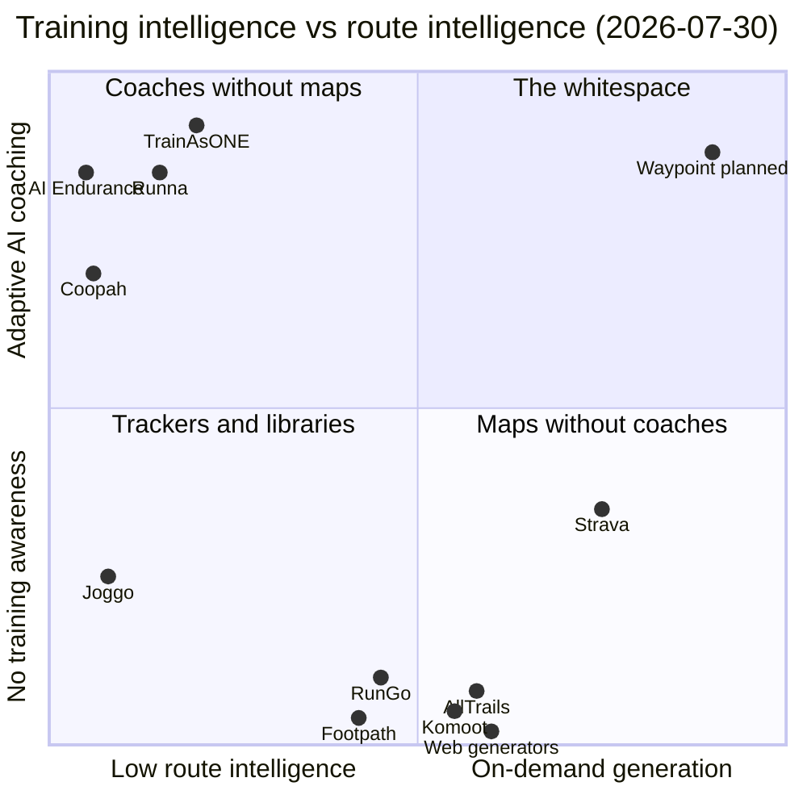

# Competitive Positioning Maps

Version-Timestamp: 2026-07-30 14:50:00 UTC-4

Two positioning maps built from the ten competitor profiles: map 1 plots training intelligence against route and location intelligence, map 2 plots target runner seriousness against price. Map 1 shows the market split into two clean clusters (coaches without maps on one side, maps without coaches on the other), with the top-right quadrant (adaptive training plus on-demand route generation) empty. Map 2 shows the committed amateur is served at every price point for coaching OR routes, but no product at any price serves both jobs. The whitespace Waypoint claims is the intersection, and it is credible because the two clusters face structural barriers to crossing over.

## Map 1: training intelligence vs route/location intelligence

Axis definitions:

- X axis, route/location intelligence: from none (no route or location capability at all) through static libraries and manual planning, to on-demand constraint-based route generation at the far right.
- Y axis, training intelligence: from none (no training awareness) through static plans and templates, to fully adaptive AI coaching that re-plans from the runner's data at the top.

Placements (each scored on the profile evidence):

| Competitor | Position | One-line justification |
|---|---|---|
| Runna | High training, low route | Category-leading adaptive plans; route capability is import-and-follow of Strava routes only (`profile-runna.md`) |
| TrainAsONE | Highest training, low route | Rebuilds the whole plan after every run with weather and terrain adjusted pacing, but zero "where to run" capability (`profile-trainasone.md`) |
| AI Endurance | High training, no route | Neural network plan optimization plus LLM chat coach; no route or location feature of any kind (`profile-ai-endurance.md`) |
| Coopah | Mid-high training, no route | Adaptive plans plus human coaching layer; nothing location-aware beyond a race finder (`profile-coopah.md`) |
| Joggo | Low training, near-zero route | Bi-weekly template adjustment and a GPS tracker with documented accuracy problems (`profile-joggo.md`) |
| Strava | Low-mid training, highest incumbent route | Only true on-demand generator (distance presets, elevation preference, surface), but popularity-ranked and training-blind; Athlete Intelligence is insight, not coaching (`profile-strava-routes.md`) |
| Komoot | No training, mid-high route | Sport-aware waypoint routing and Europe's best outdoor data, but no target-distance generation and zero training context (`profile-komoot.md`) |
| AllTrails | No training, mid route | AI adjusts existing trail routes (shorter, less steep, scenic); no generation from constraints, no training layer (`profile-alltrails.md`) |
| Footpath | No training, mid route (manual) | Best-in-class manual drawing and navigation; zero generation or training intelligence (`profile-footpath-rungo.md`) |
| RunGo | No training, low-mid route | Large static route library with excellent voice navigation; no generation, no coaching (`profile-footpath-rungo.md`) |
| Web generators | No training, mid route (dumb generation) | Instant loops from start point plus distance, nothing else; free hobby tools (`profile-footpath-rungo.md`) |
| Waypoint (planned) | High training, highest route | Constraint-based on-demand generation (distance, elevation, weather, crossings, safety, surface) with adaptive coaching layered on top (Founder Brief) |

Reading notes: TrainAsONE and Runna sit slightly right of their coaching peers because both already apply location-adjacent intelligence (weather, terrain undulation, heat) to pacing (`profile-trainasone.md`, `profile-runna.md`). Strava sits below the midline on training because Athlete Intelligence summarizes rather than prescribes, and its plan engine (Runna) is a separate app (`adjacent-platforms.md`).

## Map 2: target runner seriousness vs price

Axis definitions:

- X axis, target runner seriousness: from absolute beginner and weight-loss motivated, through the committed amateur (3 to 5 runs per week, races a few times a year), to elite and data-obsessive athletes.
- Y axis, price: effective annual cost of the relevant paid offer, from free at the bottom to $150+ at the top.

Placements:

| Competitor | Position | One-line justification |
|---|---|---|
| Nike Run Club | Beginner to mid, free | Free static plans and audio content as a shoe-brand channel (`adjacent-platforms.md`) |
| Joggo | Beginner, high effective price (~$94 to $99/yr, up to $33/mo) | Weight-loss beginners bought through quiz funnels at coaching-app prices with the shallowest engine in the set (`profile-joggo.md`) |
| Footpath | Casual to committed planners, $23.49/yr | Cheap precision utility for people who already know where to go (`profile-footpath-rungo.md`) |
| AllTrails | Recreational outdoor users, $35.99 to $79.99/yr | Hike-first discovery for explorers, not athletes; runners secondary (`profile-alltrails.md`) |
| Komoot | Recreational multi-sport, ~$59.99/yr | Cyclist and hiker core; fitness level does not even influence routing (`profile-komoot.md`) |
| RunGo | Casual to committed runners and travelers, $59.99/yr | Running-first navigation for travelers, races, and accessibility users (`profile-footpath-rungo.md`) |
| Garmin Connect+ | Mid to serious watch owners, $69.99/yr (plus hardware) | AI insight layer on top of free watch-locked coaching (`adjacent-platforms.md`) |
| Coopah | Beginner to first-marathon, $79.99/yr | Positioned by reviewers as the friendlier, cheaper, more conservative Runna alternative (`profile-coopah.md`) |
| Strava | Broad base skewing committed, $79.99/yr | Social layer plus routes for everyone from casual to elite; personalization shallow (`profile-strava-routes.md`) |
| TrainAsONE | Analytical committed to ultra, ~£99/yr | Science-first engine that skews to data-tolerant self-coached runners (`profile-trainasone.md`) |
| Runna | Committed amateur racers, $119.99/yr | The reference product and reference price for exactly Waypoint's target user (`profile-runna.md`) |
| Strava + Runna bundle | Committed amateur, $149.99/yr | The price ceiling: community, routes, and adaptive plans in one bill (`profile-runna.md`) |
| AI Endurance | Serious data-driven multi-sport, ~$156/yr annualized | Explicitly "more analytical and less guided"; not for guided beginners (`profile-ai-endurance.md`) |
| WHOOP | Serious athletes, $199 to $359/yr | Recovery hardware subscription benchmark above the app market (`adjacent-platforms.md`) |
| Waypoint (planned) | Committed amateur, ~$80 to $120/yr band | Same target user and price band as Runna, differentiated on the route job (Founder Brief, `pricing-matrix.md`) |

Reading notes: the committed amateur column of this map is crowded on price (Coopah, Strava, TrainAsONE, Runna all within $80 to $120) but every product in that column sells one of the two jobs. The beginner end is served free (NRC) or exploitatively (Joggo); the elite end pays for depth (AI Endurance, WHOOP). Nobody differentiates on WHAT is sold to the committed amateur rather than at what price. [inferred]

## The whitespace statement

The empty quadrant is map 1's top right: adaptive training intelligence combined with on-demand, constraint-based route generation. Every training product answers "how should I run" with zero location capability; every route product answers "where is a route" with zero training context; Strava, the only generator, answers "where do people like to run near here" without knowing the runner or the day's workout. Nobody answers the founding question "where should I run, right now, from here, for me" (Founder Brief).

Why the quadrant is empty. [inferred, with reasoning]

- The two clusters have different DNA. Coaching companies (Runna, Coopah, TrainAsONE, AI Endurance) are sports-science and content organizations without mapping, routing-graph, or geospatial engineering competence; their roadmaps (heat pacing, recovery plans, chat UX, B2B portals) all deepen coaching. Mapping companies (Komoot, AllTrails, Footpath, RunGo) are geodata organizations without training science; their roadmaps (heatmaps, trail conditions, redesigns) all deepen maps.
- The one player holding both assets (Strava, which owns Runna) has not connected them: the bundle marketing gestures at "personalized routes linked to your training plan" but the shipped reality is existing popularity-based suggestions next to a separate coaching app (`profile-strava-routes.md`).
- Structural blockers documented in the profiles: Komoot lost roughly 85 percent of staff to post-acquisition cuts; AllTrails is trail-locked by content model and brand; TrainAsONE and AI Endurance are 1 to 5 person teams; Coopah is seed-funded and invested in human coaching; Joggo's parent optimizes funnels, not products.

Why Waypoint claims it credibly. [inferred]

- The constraint engine is buildable without incumbent permission: OSM routing, elevation, and weather data are near zero marginal cost (per `research/01-market/_index.md`), and the profiles confirm no incumbent dataset advantage applies to crossings, safety scoring, or weather-adaptive routing, the exact parameters left open.
- Demand for each half is proven separately: the free-generator long tail proves "route from here at distance X" demand, RunGo proves willingness to pay for running navigation, Runna and TrainAsONE prove acceptance of environment-adjusted prescriptions (`profile-footpath-rungo.md`, `profile-runna.md`, `profile-trainasone.md`).
- The claim is time-boxed, not permanent: Strava can connect its pieces, and `profile-strava-routes.md` advises assuming 12 to 18 months. Credibility rests on speed to the constraint depth Strava is unlikely to prioritize (weather, crossings, safety are niche, liability-adjacent problems for a multi-sport platform per `adjacent-platforms.md`).

## Assumptions

- [assumption] Map coordinates are ordinal judgments from profile evidence, not measured scores; small differences between neighbors (for example AllTrails vs Komoot on route intelligence) are not meaningful.
- [assumption] Waypoint's placement is the planned v1 target from the Founder Brief, not a shipped capability; on any current-state map Waypoint does not yet exist.
- [assumption] Map 2 uses headline annual prices without FX conversion or promo effects; Joggo's placement uses the 12-month IAP figure as its effective annual price.
- [assumption] Adjacent platforms appear on map 2 (price context) but not map 1, where all four (Garmin, Apple, NRC, WHOOP) would cluster in or near the bottom-left and add noise without changing the whitespace conclusion; Garmin Coach would sit mid-Y at zero price but is watch-locked (`adjacent-platforms.md`).
