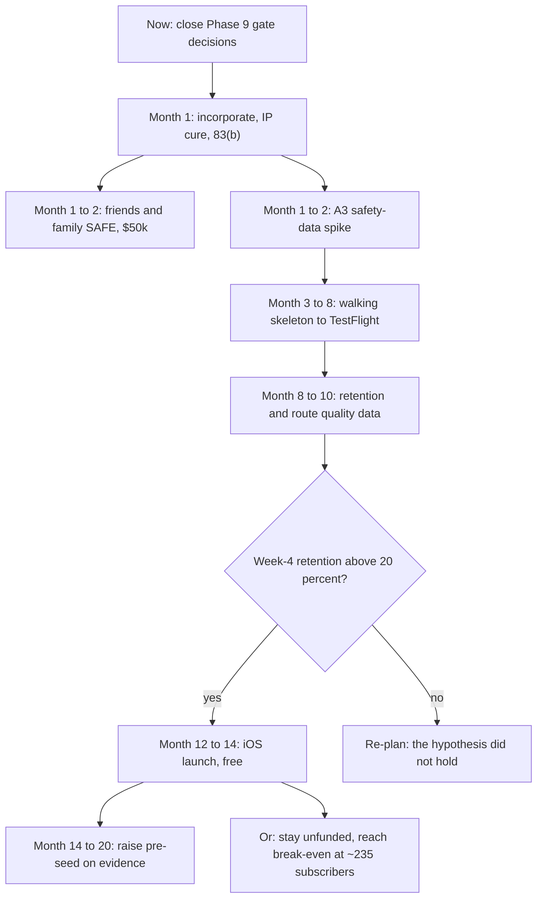

# Fundraising Plan

> Version-Timestamp: 2026-08-06 14:00:00 UTC-4
>
> **Not investment or legal advice.** Securities offerings are regulated, including small ones sold to people you know. Every instrument described here must be papered by counsel.

## 1. What changed, and why the old number was wrong

`blueprint/blueprint.md` section 13 asks for **$350,000 to $400,000** as a pre-seed. That figure is arithmetically sound and factually obsolete. It was composed of roughly $230,000 to buy contractor person-months plus six to nine months of runway at $15,000 a month. **Neither input exists.** Nobody is being hired and nobody is drawing a salary.

`operating-model.md` section 7 puts total cash consumed over three years, all the way through to break-even, at roughly **$40,000 to $53,000**.

That is not a smaller version of the same plan. It is a different kind of company, and it changes what the round is *for*:

| | Old framing | Actual |
|---|---|---|
| Purpose of the money | Buy the engineering that ships the product | Cover legal, tooling and infrastructure while the founders ship it themselves |
| Consequence of not raising | No product | Slower, and a weak legal position at launch |
| Amount | $350k to $400k | $50k |
| What is scarce | Capital | **Calendar time** (`team-roadmap.md`) |

**Raising $350,000 now would be a mistake even if someone offered it.** It would price a company with no product at a valuation that has to be grown into, sell 15 to 20 percent for money there is no plan to spend, and impose institutional expectations on a team that needs eighteen months of quiet building.

## 2. Round one: friends and family

**$50,000 on a post-money SAFE with a $1,500,000 valuation cap.** Roughly 3.33 percent.

### What it buys

| Use | Amount | Why it cannot wait |
|---|---|---|
| Privacy and compliance counsel | $8,000 to $20,000 | The largest single expense in the plan. Location plus health data makes it non-negotiable before public launch (`operating-model.md` section 4) |
| Formation and legal, including the minor-founder structure | $5,000 | Gates everything: accounts, the round itself, the IP cure |
| AI tooling, 24 months | $5,000 | The engineering budget |
| Infrastructure through launch | $8,000 | Servers, data layer, store fees |
| Test devices | $1,500 | Android fragmentation is the real driver |
| Design and store assets | $3,000 | The listing is a conversion surface |
| Contingency | $8,000 | Roughly 20 percent |
| **Total** | **~$40,000 to $50,000** | |

The round is sized to reach revenue, not to reach the next round. That is unusual and it is the correct shape here.

### Why $25,000 is too little and $75,000 too much

At **$25,000**, the privacy counsel bill alone can consume most of it, and there is no contingency in a plan whose central assumption (AI leverage) is explicitly unvalidated. Running out at month 15 with a nearly finished product is the worst available outcome.

At **$75,000**, roughly $25,000 sits unused for two years while costing 1.7 additional points of ownership. Raise it later at a much better price, if it is needed at all.

## 3. Why a SAFE, and why a $1.5M cap

### The instrument

A **post-money SAFE** (Simple Agreement for Future Equity). Not priced equity, and not a convertible note.

Priced equity requires agreeing on a valuation for a company with no product, which is a negotiation with no factual basis, plus a full legal package that can cost as much as the round. A convertible note is debt: it accrues interest and it matures, which means a date on which friends and family are technically entitled to demand money the company does not have. That is a bad instrument to point at people you will see at holidays.

A SAFE has no maturity date, no interest, and converts to equity at the next priced round. Standard, free templates exist, and investors at this level expect it.

**Post-money, not pre-money**, because post-money SAFEs make the dilution unambiguous: $50,000 at a $1.5M post-money cap is exactly 3.33 percent, computable today. Pre-money SAFEs interact confusingly with each other and with the option pool, and confusion is expensive with people who are not professional investors.

### The cap

$1.5M is a judgment call, and here is the reasoning rather than an assertion.

**What argues lower.** No product, no users, no revenue. No founder is full-time. Two founders are minors. Zero user interviews conducted (`blueprint/blueprint.md` states this plainly). By a cold read of stage alone, $750,000 to $1M would be defensible.

**What argues higher.** Nine phases of documented research, a locked concept, a validated technical stack, a competitive analysis covering fifteen products, and a 17-section investor blueprint. That is genuinely more diligence than most pre-seed companies have at Series A. There is also a real, evidenced market gap. And the capital efficiency is extraordinary: this round funds the company to break-even, which almost no seed investment does.

**Why $1.5M.** It is high enough that the founders are not giving away meaningful ownership for a small sum, and low enough that friends and family get a genuinely good deal for taking the earliest risk. It also leaves headroom: a pre-seed twelve to eighteen months later at $4M to $8M gives early backers a clean multiple, which matters when the investors are people whose relationships outlast the company.

## 4. Who to ask, and the part that is uncomfortable

Friends and family rounds are not primarily a financial transaction. Three rules.

**Only take money that can be lost entirely.** Say this out loud to every person, in those words, and believe it. Most startups fail. These are people whose relationships the founders will have for decades. If losing the money would change the relationship, do not take it.

**Two of the founders are 15.** Some prospective investors will be family members of minors, which makes the conversation more delicate rather than less. The guardians are already involved in the formation (`legal-formation.md` section 2), so they should also be fully informed about any investment coming from within the family.

**Paper it properly, especially with family.** The temptation to handle it informally with someone you trust is exactly backwards. Undocumented investments become disputes years later, and they surface in diligence as unexplained obligations. Use the SAFE, sign it, file it.

**Do not oversubscribe.** Ten people at $5,000 each is a cap table with ten signatures needed for future consents. Prefer three to five investors at $10,000 to $20,000.

Also confirm with counsel which securities exemption applies and what disclosure it requires. Small offerings to known individuals are usually straightforward, but "usually" is doing real work in that sentence and this is not the place to guess.

## 5. The path to institutional money

Do not raise institutional capital until there is a reason to, and then raise it against evidence rather than a plan.

### Milestones that unlock a real pre-seed

| Milestone | Source | Why an investor cares |
|---|---|---|
| **A3 safety-data spike passes** | DEC-013, `../05-product/mvp-scope.md` GD-3 | The riskiest assumption in the entire program. Until it clears, the differentiation claim is unproven |
| **Walking skeleton shipped to TestFlight** | `team-roadmap.md` section 6, month 3 to 8 | Proves the team can ship, which is the open question about a part-time team |
| **20 to 50 TestFlight runners, real route quality data** | `mvp-scope.md` section 6 | Turns "we think routes will be good" into a measurable Good Route Rate |
| **Week-4 retention above 20 percent** | GD-1, `../06-business-model/metrics.md` | **The single most valuable data point Waypoint can produce.** It is the hypothesis |
| **12 to 18 user interviews complete** | `../03-users/unmet-needs.md` | Closes the most conspicuous gap in the research, and diligence will ask |

Clear those and the conversation changes completely: from a team asking to be believed, to a team showing that the thing works.

### What a later round looks like

| Round | Typical dilution | Realistic timing | Precondition |
|---|---|---|---|
| Pre-seed | 10 to 20 percent | Month 14 to 20 | Retention proof plus a shipped iOS app |
| Seed | 15 to 25 percent | Month 24 to 36 | Revenue and a repeatable acquisition channel |

Dilution figures are conventional ranges [assumption]; actual terms depend on traction.

**And the genuine option of never raising again.** `operating-model.md` section 5.4 puts operating break-even at roughly **235 paying subscribers**, not the 3,000 the earlier research assumed. `../06-business-model/revenue-model.md` section 6.2 models 480 subscribers in its base case by month 12 of revenue. If that holds, Waypoint becomes self-sustaining without institutional money at all.

That should be treated as a real strategic option and not a fallback. It changes negotiating position: a company that does not need money raises on better terms than one that does. It also fits the honest reading of H5 in `blueprint/blueprint.md` section 3, which came back **uncertain** on whether the route wedge alone supports a venture-scale outcome. A profitable $3M to $10M business is an excellent outcome for three founders and a poor one for a fund, and knowing which game is being played is worth more than optimism about it.

## 6. How an investor will actually read this team

Better to write these down than to be surprised by them in a meeting.

### What they will worry about

**Nobody is full-time.** The most common single reason pre-seed investors pass. The honest answer is the one in `team-roadmap.md`: the scope has been cut to fit the capacity, the schedule is derived rather than hoped for, and there is a month-6 checkpoint that recalibrates against measured data instead of defending an assumption.

**Two founders are minors.** Some investors will find this genuinely charming and some will find it disqualifying. Neither reaction is worth arguing with. What is worth doing is having the legal structure already clean, so the answer to "how does that work?" is a document rather than a shrug. That is what `legal-formation.md` is for.

**Key-person concentration on Daniel.** If he stops, everything stops. There is no honest way around it at this size; the mitigations in `team-roadmap.md` section 2 (documented architecture, a second person into the codebase) are real but partial.

**Capacity versus the competitive window.** A month 12 to 14 launch sits at the late end of the 12 to 18 month window from Phase 1. That is tight and should be stated as tight.

**No user interviews yet.** The blueprint already says so under the hero. Volunteering it is much better than being caught by it.

### What is genuinely strong

**Capital efficiency that is hard to overstate.** Roughly $40,000 to $53,000 to reach break-even. Most funds have never seen that number.

**An embedded target user as a co-founder.** Asher runs the routes. Consumer teams routinely spend heavily for worse customer access than this.

**Research depth well beyond the stage.** Nine phases, 45-plus documents, sourced and confidence-tagged, with an explicit self-audit of what is not known.

**Intellectual honesty in the materials.** The blueprint names H5 as uncertain, states the absence of interviews, and shows that unit economics depend on distribution rather than pricing. Investors notice this, because almost nobody does it.

## 7. Diligence readiness checklist

Close these before they are asked about. Every item below is something a competent lawyer finds within an hour.

### Corporate

- [ ] Delaware C-corp incorporated, certificate and bylaws filed
- [ ] Board appointed, initial consents executed
- [ ] EIN obtained
- [ ] Founder RSPAs signed by all three, with UTMA custodial issuance for Asher and Claudio
- [ ] **83(b) elections filed within 30 days of issuance**, including by both custodians, with mailing receipts retained
- [ ] Cap table maintained from day one, not reconstructed later

### Intellectual property, the highest-risk category

- [ ] PIIAA signed by all three founders
- [ ] **Guardian co-signature on both minor founders' PIIAAs**
- [ ] Pre-formation IP assigned by explicit written agreement
- [ ] **Re-execution scheduled for Asher's 18th birthday** (date: ____)
- [ ] **Re-execution scheduled for Claudio's 18th birthday** (date: ____)
- [ ] Any AI-assisted code reviewed for third-party licence contamination
- [ ] OpenStreetMap ODbL boundary documented, per the open risk in `../05-product/api-integration-map.md`

### Financial

- [ ] Business bank account, entirely separate from personal accounts
- [ ] Pre-formation founder spend logged, then reimbursed or noted (`capital-structure.md` section 6)
- [ ] All subscriptions moved from personal to company payment
- [ ] Bookkeeping from the first transaction

### Commercial and compliance

- [ ] Apple Developer Program enrolled as an organization, Daniel as Account Holder
- [ ] Google Play Console enrolled and verified
- [ ] Privacy policy, terms of service, and DPIA completed before public launch
- [ ] Strava API terms reviewed against the documented AI-use restriction
- [ ] Vendor agreements (Aiven, Hetzner) held by the entity, not an individual

## 8. Materials

Most already exist, which is unusual and worth using.

| Material | Status | Note |
|---|---|---|
| `blueprint/index.html`, 17 sections | Exists; sections 12 and 13 rewritten by this phase | The primary document |
| Research corpus, 45-plus documents | Exists | Diligence backup. Few pre-seed teams can produce this |
| `dashboard/index.html` | Exists | Shows the decision trail, including where recommendations were overridden |
| 10 to 12 slide deck | **Missing** | Nobody reads a 17-section document cold. Build it from the blueprint |
| Financial model as a spreadsheet | **Missing** | `operating-model.md` section 7 is the content; investors want it in a sheet they can change |
| One-page executive summary | **Missing** | The thing that actually gets forwarded |

**Do not build the missing three yet.** They are for the pre-seed, twelve to eighteen months out, and they should be built against real data rather than projections.

## 9. Sequence

## 10. Assumptions

- [assumption] $50,000 is raisable from this network. Entirely untested and it is the precondition for everything else here.
- [assumption] The $1.5M cap. A judgment call, argued in section 3.
- [assumption] Pre-seed at 10 to 20 percent and seed at 15 to 25 percent. Conventional ranges.
- [assumption] Privacy counsel at $8,000 to $20,000, inherited from `../06-business-model/unit-economics.md` section 1.5 and never quoted by a firm. It is the largest line in the use of funds and the least validated.
- [assumption] The milestone list in section 5 is what an investor will actually want. Derived from the program's own gate criteria rather than from investor conversations, because none have happened.
- [verified] Total three-year cash requirement of roughly $40,000 to $53,000 (`operating-model.md` section 7).
- [verified] Break-even at roughly 235 paying subscribers (`operating-model.md` section 5.4).

## 11. Open questions

1. Who specifically is on the friends-and-family list, and does $50,000 exist within it?
2. Does any prospective investor's involvement create a conflict with a guardian's role in the formation?
3. Which securities exemption applies, and what disclosure does it require?
4. Do the founders want to build toward venture scale, or toward a profitable independent business? Section 5 argues these are genuinely different games and the answer should be explicit rather than assumed.
5. Can the privacy counsel engagement be staged, with a TestFlight-scope package first? It would materially reduce the round size needed.

## Related

- `operating-model.md` for what the money is actually spent on
- `capital-structure.md` section 8 for the dilution this round causes
- `legal-formation.md` for the structure that has to exist before the round can close
- `blueprint/blueprint.md` section 13, which this document rewrites
