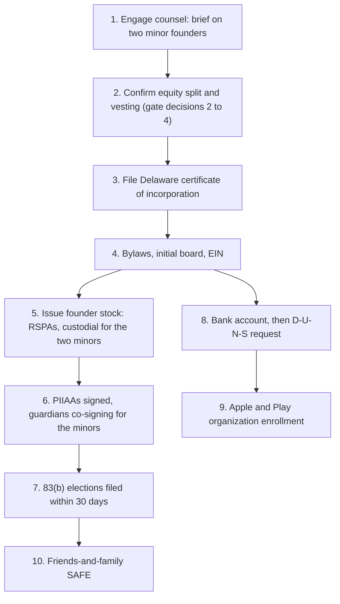

# Legal Formation and Entity Structure

> Version-Timestamp: 2026-08-06 14:00:00 UTC-4
>
> **This is not legal advice.** It is a founder-level framework for instructing a startup attorney efficiently. Formation involving minor founders is a specialist matter, and it is the specific case where paying for an hour of real counsel is not optional. The build budget already carries $8,000 to $20,000 for legal (`../06-business-model/unit-economics.md` section 1.5).

## 1. The fact that shapes everything

Two of the three founders are minors. Asher and Claudio are entering 10th grade, so both are roughly 15 or 16, and both will remain minors for approximately two to three more years.

This is not a footnote. It changes who can sign what, who can hold which accounts, how shares are issued, and whether the company's ownership of its own product survives a lawyer reading the file. Handled at formation it costs a few extra documents. Discovered during a financing it is expensive, slow, and negotiated from the weak side of the table. [verified]

Three consequences, in descending order of how badly they bite:

| # | Consequence | Severity |
|---|---|---|
| 1 | An IP assignment signed by a minor is **voidable at the minor's election** | Existential. The two people who originated the concept are the two who could take it back |
| 2 | A minor cannot hold the **Apple Developer Program** account, and by the same reasoning cannot hold the Play Console, bank, or vendor contracts | Operational blocker on shipping |
| 3 | Minors can own stock, but not directly in the ordinary way; it needs a **custodial structure** | Procedural, and cheap if done at formation |

## 2. The IP problem, which is the real one

Minors generally lack the legal capacity to contract. Contracts they sign are typically **voidable at the minor's election**: the minor may disaffirm, and the counterparty cannot hold them to it. This applies squarely to a Proprietary Information and Invention Assignment Agreement. [verified: general principle of US contract law; see also the sources in section 9]

The specific danger here is not theoretical. `../04-synthesis/concept.md` records that the concept, the product ideas, and the initial feature set originated with Asher and Claudio. **The two people whose assignment is voidable are the two people the company's core IP came from.**

Under US copyright and patent law, every line of code, every design element, and every invention belongs to its individual creator until it is transferred to the corporation in writing. A company without valid, present-tense assignments does not own its own technology. That defect surfaces at the first serious diligence and cannot be remediated without disclosure. [verified]

### The cure path

Neither step alone is sufficient. Both are needed.

1. **Guardian co-signature at formation.** A parent or legal guardian signs the PIIAA alongside each minor founder. This substantially strengthens enforceability, because the adult is contractually bound in their own right. It is what makes the company's title defensible today.
2. **Re-execution on reaching majority.** Within 30 days of each of Asher's and Claudio's 18th birthdays, each re-executes the same assignment as an adult with full capacity, ratifying everything assigned before. This is what makes the title clean, and it is the step teams forget because it falls two or three years after the excitement of incorporating.

Set a calendar reminder for each date now. Put the two dates in the diligence tracker in `fundraising-plan.md` section 7 and in the company's own records. A missed re-execution is a defect an acquirer's counsel will find in an afternoon. [inferred]

**Guardians are willing.** Confirmed by the founders on 2026-08-06, which is what makes this whole structure available. Without willing guardians, the honest options narrow to delaying formation or restructuring ownership, both of which are worse.

## 3. How the minor founders hold their shares

Minors can beneficially own stock. What they cannot reliably do is execute the stock purchase agreement, exercise voting rights, or make tax elections. The standard answer is a custodial structure.

Delaware's Uniform Transfers to Minors Act (Title 12, Chapter 45) provides it. An adult custodian holds the shares for the minor's benefit. Under § 4509 and § 4510 the custodial property is **indefeasibly vested in the minor**, meaning the minor genuinely owns it and the transfer is irrevocable, while the custodian holds all rights, powers, duties and authority with respect to that property. The minor's legal representative has no separate authority over it. [verified: Delaware Code Title 12, Chapter 45]

Practically:

| Who | Holds | Does |
|---|---|---|
| Daniel | Common stock directly | Signs his own RSPA and PIIAA, files his own 83(b) |
| Custodian for Asher (a parent or guardian) | Asher's common stock as UTMA custodian | Signs the RSPA, votes the shares, files the 83(b) |
| Custodian for Claudio (a parent or guardian) | Claudio's common stock as UTMA custodian | Same |

Custody terminates and the shares transfer outright to the beneficiary at the age the statute specifies, which varies and should be confirmed with counsel for the chosen state. Confirm too whether to use Delaware's UTMA or the founders' home-state UTMA; the answer usually follows the custodian's residence rather than the state of incorporation. [inferred, confirm with counsel]

A note worth making to the two of them directly: **being held in custody does not make the ownership less real.** The statute is explicit that the property vests indefeasibly in the minor. The custodian is a steward, not an owner.

## 4. The 83(b) election and its 30-day wall

Founder stock is issued subject to vesting, which under IRC § 83 is a substantial risk of forfeiture. Without an election, each vesting event is taxable as ordinary income at the then-current fair market value, which is the classic founder tax disaster: tax bills on paper gains from shares nobody can sell.

An 83(b) election recognizes all the income at issuance, when the stock is worth essentially nothing, and converts all future appreciation into long-term capital gain. [verified]

**It must be filed within 30 days of the stock transfer. There are no extensions.** This is the single hardest deadline in the entire formation, and the one most often missed.

For the minor founders, the custodian files it. Build the filing into the formation checklist rather than treating it as follow-up, because the 30 days run from issuance, not from when someone remembers. [inferred]

## 5. Who must hold the operational accounts

Apple requires enrollment by someone who is **the legal age of majority in their region**, and for organization enrollment the person enrolling becomes the Account Holder and must have **legal authority to bind the organization**. The organization must be a real legal entity; Apple does not accept DBAs, fictitious names, or trade names. Organization enrollment also requires a **D-U-N-S number, which can take up to 14 business days to obtain**, and total enrollment commonly runs two to four weeks. [verified: Apple Developer enrollment documentation, accessed 2026-08-06]

The same logic, for the same reason, governs everything else with a contract behind it.

| Account | Holder | Lead time | Note |
|---|---|---|---|
| Apple Developer Program (organization) | **Daniel** | 2 to 4 weeks including D-U-N-S | $99/year. Start the D-U-N-S request first; it is the long pole |
| Google Play Console (organization) | **Daniel** | Weeks, plus identity verification | $25 one-time. `../05-product/api-integration-map.md` section 4.3 already flags Play verification as a long-lead item |
| Business bank account | **Daniel**, after EIN | Days | Needs the EIN and formation documents |
| Aiven, Hetzner, and other vendors | **Daniel** or the entity | Immediate | Contracts, so an adult signs |
| AI tooling subscriptions | Daniel today, move to the entity after formation | Immediate | Currently personal spend; see `operating-model.md` section 6 |

**The Account Holder decision is not reversible cheaply.** Apple's guidance is explicit that whoever enrolls becomes the Account Holder and that losing that person means losing control of the account. Daniel holding it is correct here, but it concentrates key-person risk, which `fundraising-plan.md` section 6 treats as a real investor concern rather than a formality.

There is a second-order point worth saying plainly: **the App Store seller name will be the company's legal name.** That is another reason to incorporate before enrolling rather than shipping under an individual's personal name and migrating later.

## 6. Recommended sequence

Incorporate **before** the friends-and-family round, not after. Three reasons: the round needs an entity to receive the money and issue the instrument; the 83(b) clock is far safer to run while the company is provably worth nothing; and the Apple and Play lead times are weeks, so starting them late delays the build for no reason.

Steps 5, 6 and 7 are one event, not three. The stock issuance, the assignments, and the tax elections should be executed as a single sitting with counsel, because the 30-day clock in step 7 starts at step 5.

## 7. What incorporating actually costs

| Item | Cost | Note |
|---|---|---|
| Delaware incorporation filing | $90 to $200 | Varies with expedite and authorized share count |
| Registered agent | $50 to $300/year | Required; Delaware needs an in-state agent |
| EIN | $0 | Direct from the IRS; do not pay a service for this |
| Delaware franchise tax | $175 to $450/year minimum | Use the assumed-par-value method, not the authorized-shares method, or the bill is far larger |
| Formation counsel, standard package | $2,000 to $5,000 | Certificate, bylaws, board consents, RSPAs, PIIAAs, 83(b) instructions |
| **Additional counsel for the minor-founder structure** | **$1,000 to $3,000** | UTMA custodial issuance, guardian co-signatures, the re-execution schedule. This is the premium this situation carries |
| D-U-N-S number | $0 | Free, but allow up to 14 business days |
| **Total year one** | **$3,300 to $9,000** | Modeled at **$5,000** in `operating-model.md` |

All figures are [assumption] except the D-U-N-S cost and lead time and the EIN cost, which are [verified]. Delaware filing and franchise tax figures are directional and should be confirmed at filing time.

## 8. Open questions for counsel

Take this list into the first call. It is the difference between an efficient hour and an exploratory one.

1. Which state's UTMA governs the custodial accounts: Delaware, or the custodians' home state? At what age does custody terminate there?
2. Can a minor serve as a **director** or **officer** of a Delaware corporation? The DGCL does not obviously bar it, but signing authority is the practical question and the answer affects how board consents get executed. Both minor founders will want real governance roles.
3. Does the guardian co-signature model fully cure the disaffirmance risk on the PIIAA, or is a specific ratification instrument preferable?
4. Are there **child labor or wage-and-hour** implications if either minor founder is ever compensated in cash rather than only equity? The current plan pays no cash, which likely avoids this, but the answer should be known before that changes.
5. Should the pre-formation IP, which exists today as concept and research work product, be assigned by a separate contribution agreement at formation, given that it predates the entity?
6. Any securities-law considerations in issuing stock to minors, and in accepting friends-and-family SAFE money from people who may be related to the founders?

## 9. Sources

- Delaware Code, Title 12, Chapter 45 (Uniform Transfers to Minors Act), especially the provisions on transfer, custodial property vesting indefeasibly in the minor, and successor custodians. https://delcode.delaware.gov/title12/c045/ [verified, accessed 2026-08-06]
- Apple Developer, "Enrollment" and "Become a member": legal age of majority requirement, organization legal entity and legal binding authority requirements, D-U-N-S number and its lead time, $99/year. https://developer.apple.com/support/enrollment and https://developer.apple.com/programs/enroll/ [verified, accessed 2026-08-06]
- Voidability of minors' contracts and the recommendation to re-execute IP assignments at majority or have a guardian sign: general US contract-law principle, corroborated across startup formation practice guidance. [verified as principle; the specific application here should be confirmed by counsel]
- Standard Delaware founder package (certificate, bylaws, board resolution, RSPA with four-year vesting and one-year cliff, nominal consideration, PIIAA, 83(b) within 30 days with no extensions): consistent across multiple formation-practice sources. [verified]
- Google Play Console $25 one-time fee and organization verification: `../05-product/api-integration-map.md` section 4.3. [verified]

## Related

- `capital-structure.md` for what the shares issued here actually represent
- `fundraising-plan.md` section 7 for the diligence tracker these items feed
- `operating-model.md` section 3 for where the formation cost lands in the burn table
